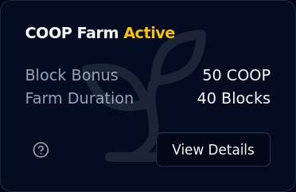
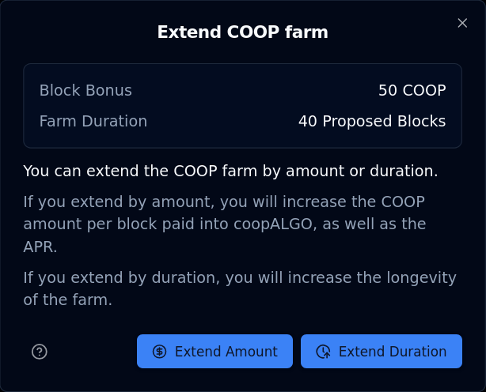
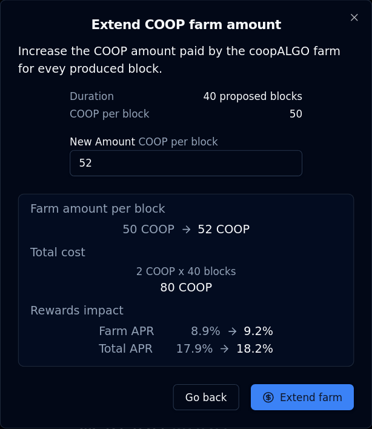
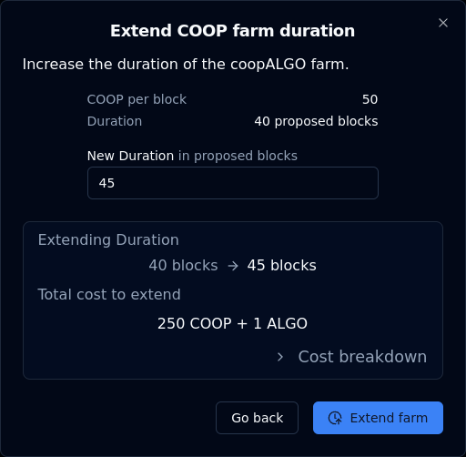

# Farm provision

> _dualSTAKE farms offer your users a higher overall APR in return for choosing to stake on your dualSTAKE token over other appealing liquid staking options in the ecosystem._

dualSTAKE farms can be configured to pay out an extra amount of the paired ASA for each block produced by dualSTAKE contracts.

Farms are permissionless, immutable and extendable:

- anyone can set them up
- once set up, farms can not be cancelled
- anyone can extend an existing farm by contributing more ASA

Farms complete the synergy between your ASA and its dualSTAKE form. Read about the benefits of providing farms below.

_Note: Farms only support the paired ASA of each dualSTAKE contract, e.g. `gobtcALGO` farms are only compatible with `goBTC`._

## Farming benefits

**As an ASA creator or community, dualSTAKE farms allow you to utilize your ASA treasury into a buying pressure incentive.**

1) increase the APR of your dualSTAKE token, making it more competitive and appealing to users.
2) more ALGO locked ➡ more frequent blocks produced ➡ stronger buying pressure.
3) provide additional soft-lock utility to your ASA via dualSTAKE

Offering a higher APR compared to competing staking options will incentivize your users to stake their `ALGO` on your community's dualSTAKE token. More `ALGO` staked means more blocks produced, which results in more frequent swaps, producing stronger buying pressure on your ASA.

As rewards accumulate and are swapped, the exchange rate of the dualSTAKE token to the ASA increases globally for all holders, current and future. As a secondary benefit, minting new dualSTAKE tokens will require more of the ASA as time moves on, which provides a **soft-lock utility for tokens making use of this system.**

## Create a farm

To create a farm for any dualSTAKE token, navigate to its page and locate the farm panel.

If there is no existing farm, you will see a panel like the one shown below.

Click through `Create Farm` to begin. You will see a form like this:

Fill in your desired duration and amount per block:

- **Duration** is expressed in blocks produced by your dualSTAKE node.
  - Duration does not affect the displayed APR calculations
  - The maximum duration for a farm is dependent on the amount of ALGO staked. It will roughly correspond to the expected block production over a period of 45 days (with a floor duration of 30 blocks.)
- **Farm amount** is the amount of your ASA that will be added into dualSTAKE with each block produced
  - This does affect the displayed APR calculations

Click `Calculate cost` to show the total cost and projected APR impact.

When you are satisfied with your parameters, click `Create farm` to complete the process.

### ALGO cost breakdown

Aside from the ASA payments, there are additional ALGO costs to creating a farm, or extending the duration of an existing farm.

You can click `> Cost breakdown` to expand a drill-down into the farm creation costs:

This adds up to a total cost of 0.2 ALGO per block (duration):

- 0.1 ALGO per block is used to incentivize execution of the farms.
  - dualSTAKE farms are an open system, with a published SDK. Anyone can call the farm contracts to initiate a payout, which is rewarded with 0.1 ALGO as an execution incentive.
- 0.097 ALGO per block is paid as a platform fee.
- 0.003 ALGO per block is used to cover inner transaction fees by the farm contract.

Some additional fixed costs may apply depending on the inner state of the contract:

- 0.1 ALGO ASA Opt-in fee
- 0.0185 ALGO On-chain (box) storage fee

## Extend farms

When a farm is already set up, anyone can extend its duration or amount. To do so, locate the farm panel:

Then click `View Details`:

Then click `+ Extend Farm`:

From here, you can access the forms to extend a farm by amount (paid per block) or duration (in blocks produced)

### Extend Farm Amount

Extending the farm's amount paid per block will increase the overall APR of your dualSTAKE. This should make it more appealing to your community to stake, resulting in more ALGO, more frequent blocks produced, and more buying pressure.

From the panel at the end of the previous section, click `Extend Amount` to access this form:

From here you can increase the farm amount per block paid out by the farm.

Fill in your desired amount and click `Calculate cost`.

You will see the total cost of your operation, as well as the impact to the APR:

When you are satisfied with your parameters, click `Extend farm` to complete your operation.

### Extend Farm Duration

Extending the farm duration increases its longevity. _Note: the APR calculations shown on the site are "spot" calculations, so the farm durations are not taken into account._

From the panel at the end of the [`Extend farms` section](#extend-farms), you can click `Extend Duration` to access this form:

Fill in your desired duration and click `Calculate cost`:

You can click `> Cost breakdown` to drill down into the ASA and ALGO costs of this operation. These costs are documented [here](#algo-cost-breakdown).

When you are satisfied with your parameters, click `Extend farm` to complete your operation.
