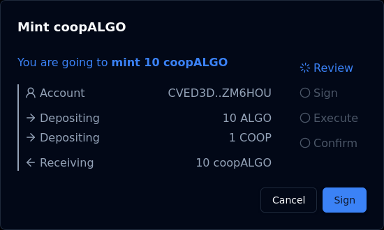

# Minting

Users stake in a dualSTAKE contract by minting dualSTAKE tokens. This requires depositing `ALGO` and some of the paired ASA into the dualSTAKE smart contract.

Using `coopALGO` as an example, a user would mint by depositing:

- `ALGO` at a fixed 1:1 rate
- `COOP` at the current [exchange rate](./rate.html)

In return, they receive an equal amount of `coopALGO` tokens to the `ALGO` they deposited.

Minting does not incur any platform fees.

_E.g. If `coopALGO` is at 10:1 with `COOP`, the user would deposit 10 `ALGO` + 1 `COOP` to receive 10 `coopALGO` tokens._

> Not sure what this is all about? Start over from [the overview page](./overview.html).

Continue to: ["Where does the yield come from?"](./rewards.html) or navigate to a specific section using the menu.
