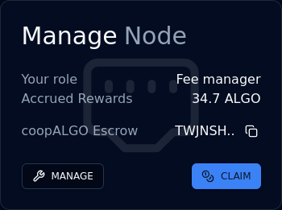
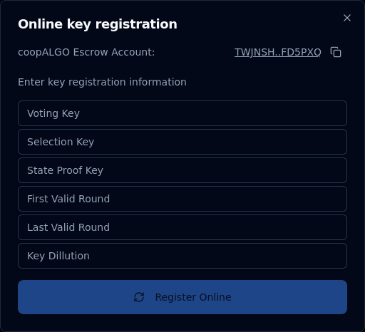

# Running a dualSTAKE node

dualSTAKE contracts currently operate with a single escrow account. A node runner is appointed to participate on behalf of dualSTAKE by the ASA leadership or Myth Finance.

ASA communities are expected to operate their nodes and reap the additional rewards:

Node runners accrue fees from rewards, in ALGO. Fees can withdrawn at any time. The default node runner fee is 4%, though this can be configured under [the protocol safeguards](./immutability.html#fee-configuration).

The node runner [account](./roles.html#node-runner) can:
- change the participation keys of the contract, as well as the online/offline state.
- change the node runner account to another address
- withdraw accrued node runner fees

The "fee admin" role held by Myth Finance can also perform these actions.

## How to run a dualSTAKE node

This section will walk you through (1) Generating participation keys, (2) registering them through the website, and (3) setting up Allo Alerts monitoring.

When you **connect the node runner account** and **visit your dualSTAKE token page,** you will see the `Manage Node` panel:

_Note: you need to be allocated the node runner role by the Myth Finance team before you can perform these tasks._

### 1. Generate participation keys

First, you need to create participation keys for the dualSTAKE escrow account on your node.

Copy the address using the Copy button next to the `xyzALGO escrow` address (e.g. `TWJN..` above).

Create participation keys for this account on your node.

Recommended duration: at least 3,000,000 rounds (approximately 90 days.)

### 2. Register the keys

In the `Manage Node` panel, click `MANAGE`, then `Key Registration`, then `Online`. You will see a form like the one shown below.

Copy the participation key information from your node **carefully** and double-check the values. _Note: The "Voting key" field may be called "Vote key" on your node._

Click `Register Online` and sign the transaction.

_Note: The first time you register a dualSTAKE account online will require a 2 ALGO fee for protocol rewards eligibility._

That is all: your node should now be participating on behalf of the dualSTAKE escrow account.

_Note: The consensus online status on the dualSTAKE pages will take up to 15 minutes to update. Do not be concerned if it does not update to ONLINE immediately._

### 3. Monitor your node

**We strongly recommend setting up an Allo Alerts account**. This free service provided by Nodely will notify you of important node events, like degraded voting performance, upcoming key expiration, etc.

1. Create a free account on [alerts.allo.info](https://alerts.allo.info/monitoring) using your email address.
2. Navigate to `Monitoring` -> `Add new`
3. Enter the **dualSTAKE escrow address** that you generated participation keys for
4. Label it with the dualSTAKE name, e.g. `coopALGO` and click `SAVE`
5. Click `Add Trigger` and add the `Voting Performance` trigger
6. Click `Add Trigger` and add the `Key Expiration` trigger
7. Click `Add Trigger` and add the `Online/Offline Status` trigger

You should now receive notifications via email when any of these alarms are triggered.

## Renew participation keys

Your participation keys will eventually expire. If you have set up Allo alerts (see above), you will be notified about this event about a week before it takes place.

To renew your participation keys, follow the [key registration procedure above](#how-to-run-a-dualstake-node): generate new participation keys and register them online.

## Claim your node runner rewards

In the `Manage Node` panel, you can click the `CLAIM` button to withdraw your accrued node runner fees.

## Transfer the node runner role

If you want to transfer the node runner role to another account, you can do so through the `Manage Node` panel.

Click `Manage`, then `Transfer Noderunner Role` and fill in the address you want to set as the node runner.

_Note: before you can transfer the node runner role, you need to withdraw any accrued node runner fees._
