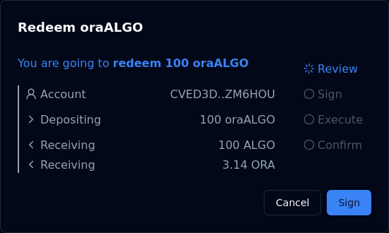

# Redeeming

Users can redeem their dualSTAKE tokens at any time. Redeeming breaks dualSTAKE up into their component `ALGO`+ASA parts and returns them to the user.

Using `oraALGO` as an example:

Users can redeem their `oraALGO` tokens via the smart contract and receive the backing `ALGO` (at 1:1) and accrued `ORA` (at [current redeem rate](./rate.html#redeem-exchange-rate)).

Assuming staking rewards have accumulated between minting and redeeming, the `ORA` amount withdrawn during redemption will be larger than the deposited amount during mint.

_E.g. Alice minted 100 `oraALGO` by depositing 100 `ALGO` and 1 `ORA`. Some time later, `oraALGO` has appreciated against `ORA`, so she redeems her 100 `oraALGO` tokens for 100 `ALGO`, plus 3.14 `ORA`._

> Not sure what this is all about? Start over from [the overview page](./overview.html).

Minting and redeeming do not incur platform fees, but minting requires an additional micro unit of the ASA, so if a user mints any amount of `oraALGO` and then redeems it immediately, they would receive 0.00000001 `ORA` less than what they deposited.

Continue to: ["Protesting"](./protesting.html) or navigate to a specific section using the menu.
